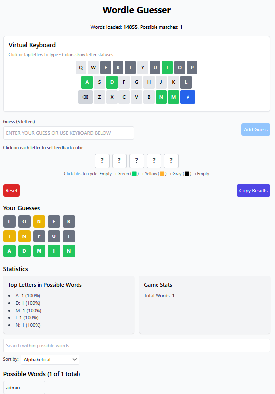

# Wordle Guesser

An interactive tool to help you solve Wordle puzzles by suggesting possible words based on your previous guesses and feedback.

<div align="center">
  
</div>

## Features

- Enter your Wordle guesses and receive color-coded feedback
- Interactive feedback input - click on letters to cycle through colors
- **Interactive virtual keyboard** for easy word entry - perfect for mobile devices
- Visual keyboard showing the status of each letter with color-coding
- Multiple sorting methods for possible words:
  - Alphabetical
  - Letter frequency (suggests words with common letters)
  - Positional frequency (suggests words with letters in common positions)
- Statistics about remaining words and letter distribution
- Copy results to clipboard for sharing
- Simple, intuitive user interface with Tailwind CSS
- Over 14,000 five-letter words built into the application
- Instant word filtering with efficient algorithms
- Mobile-responsive design with touch-friendly controls

## Installation

1. Clone the repository:
   ```bash
   git clone https://github.com/yourusername/wordle-guesser.git
   cd wordle-guesser
   ```

2. Install dependencies:
   ```bash
   npm install
   ```

3. Start the development server:
   ```bash
   npm start
   ```

4. Open [http://localhost:3000](http://localhost:3000) to view it in your browser.

## How to Use

1. Enter your Wordle guess (a 5-letter word) in the input field or use the **virtual keyboard**
2. **Setting Feedback Colors**:
   - Click on each letter in your guess to cycle through feedback colors
   - Green (🟩): Correct letter in the correct position
   - Yellow (🟨): Correct letter in the wrong position
   - Gray (⬛): Letter not in the word
3. Click "Add Guess" or press the enter button (↵) on the virtual keyboard
4. View suggested words based on your guesses and feedback
5. Use the search box to filter within possible words
6. Select a sorting method to help find the best next guess
7. Click on any suggested word to use it as your next guess
8. Continue until you solve the puzzle!

## Keyboard Navigation

- Use the virtual keyboard to type your guesses by clicking or tapping
- Backspace button (⌫) removes the last letter
- Enter button (↵) submits your guess
- All letter keys show their current status through color-coding

## Troubleshooting

If no possible words are shown:
- Double-check that your feedback colors accurately match what Wordle showed
- Make sure you've set feedback for all letters in your guess
- Try a different guess if the current one might have incorrect feedback

## Example Workflow

1. Start with a word like "STARE" (a good first guess with common letters)
2. Enter "STARE" in Wordle and note which letters are green, yellow, or gray
3. In Wordle Guesser:
   - Type "STARE" in the guess field
   - Click on each letter to set the corresponding color from Wordle
   - Click "Add Guess"
4. Look at the suggested words that remain possible
5. Choose one of the suggested words for your next guess in Wordle
6. Repeat steps 2-5 until you solve the puzzle

## Understanding the Visual Keyboard

The visual keyboard shows the status of each letter based on all your guesses:
- Green: This letter is confirmed to be in the correct position
- Yellow: This letter is in the word but in a different position
- Gray: This letter is not in the word
- White: This letter hasn't been used in any guesses yet

## Statistics and Analysis

The statistics section shows:
- Total number of remaining possible words
- Most common letters in the remaining word pool with percentages
- This helps you make strategic guesses to narrow down possibilities more effectively

## How the Algorithm Works

The word filtering algorithm has been enhanced to handle complex scenarios:

1. **Green letters**: Must be in the exact position specified
2. **Yellow letters**: Must be in the word, but not in the position where they were marked yellow
3. **Gray letters**: Must not appear in the word, unless that letter also appears elsewhere and is marked yellow or green
4. **Letter frequency**: Correctly handles cases where a letter appears multiple times, including when some instances are marked gray while others are yellow or green

## Word Ranking Strategies

The app offers multiple ways to sort possible words:

1. **Alphabetical**: Simple alphabetical sorting
2. **Letter Frequency**: Ranks words based on how often their letters appear in the remaining word pool
3. **Positional Frequency**: Ranks words based on how often letters appear in specific positions in the remaining word pool

These strategies help you choose the most informative next guess to quickly solve the puzzle.

## Wordle Strategy Tips

- Start with words that have common letters (E, A, R, T, S, I, O, N)
- Use words with many different letters in your first few guesses
- After finding some green letters, use the positional frequency sorting
- When you have several yellow letters, use the letter frequency sorting
- Look for common prefixes and suffixes in the remaining words

## Technologies Used

- **React**: Frontend library for building the user interface
- **Tailwind CSS**: Utility-first CSS framework for styling
- **JavaScript**: Core programming language
- **React Hooks**: For state management and side effects

## Contributing

Contributions are welcome! Here's how you can contribute:

1. Fork the repository
2. Create a feature branch: `git checkout -b new-feature`
3. Commit your changes: `git commit -am 'Add new feature'`
4. Push to the branch: `git push origin new-feature`
5. Submit a pull request

## License

MIT
